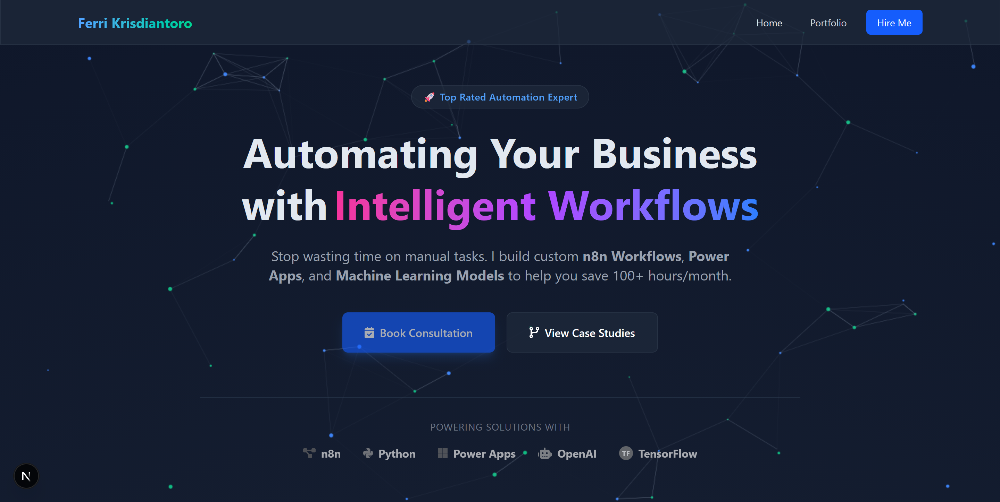
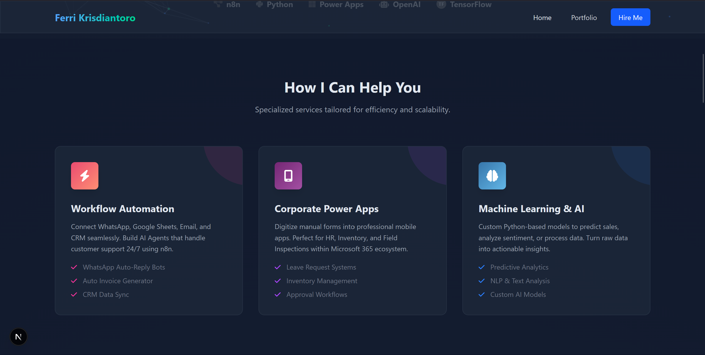
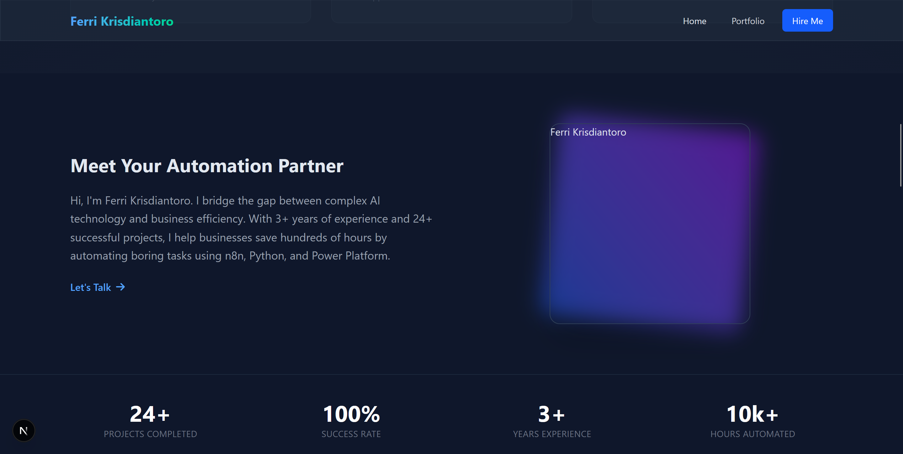
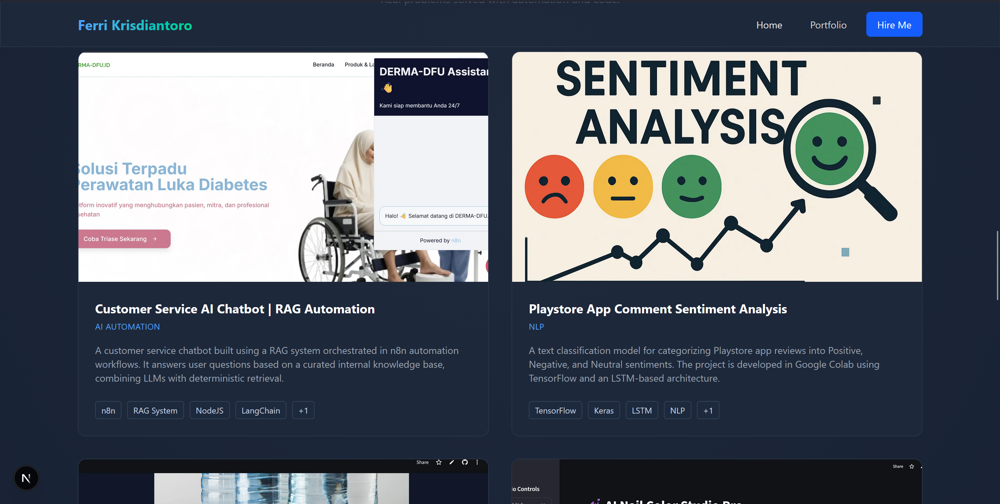
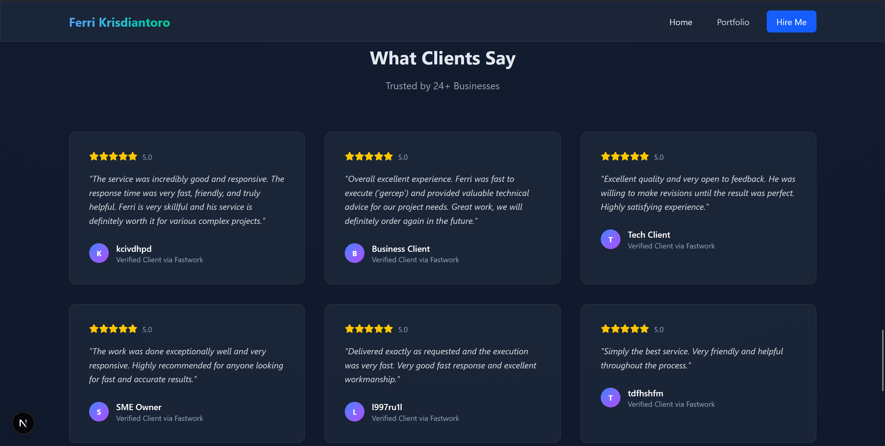
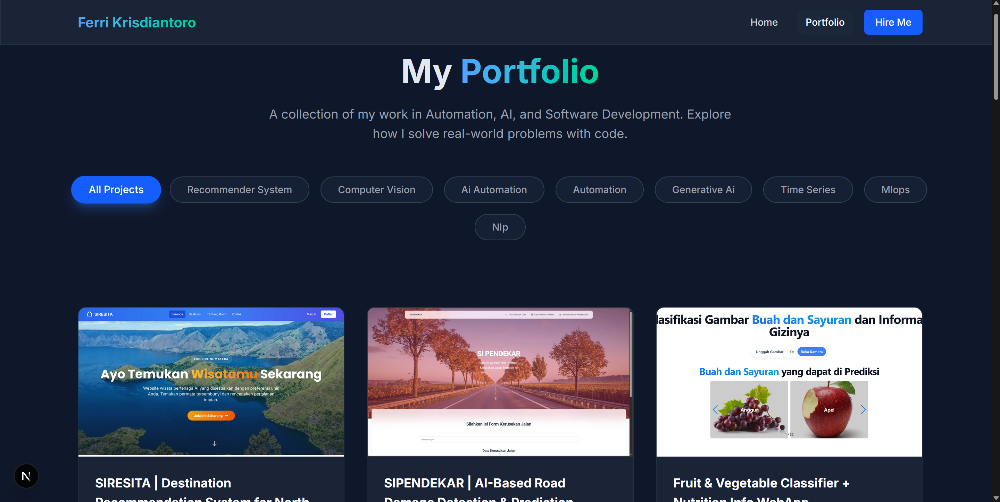
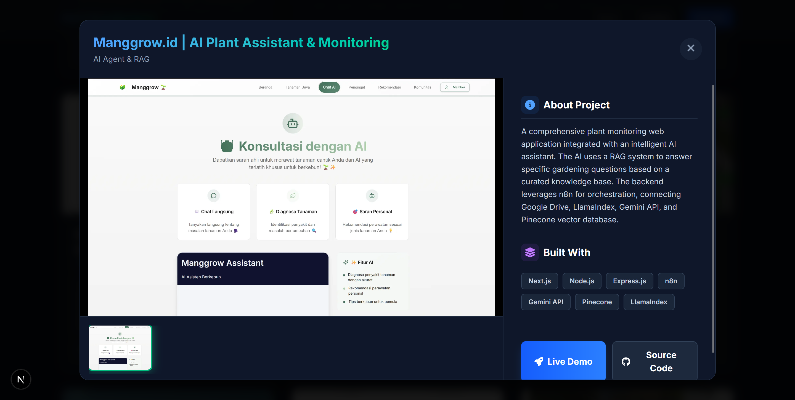

# Ferri Krisdiantoro Portfolio 🚀

<div align="center">
  
  <br />
  
</div>

<div align="center">


</div>

---

## 🚀 About The Project

**Ferri Krisdiantoro Portfolio** is a modern, high-performance personal website built to showcase expertise in **Automation, AI, and Software Development**. 

It goes beyond a static resume by offering an **interactive experience**:
- **Dynamic Project Gallery**: Filterable case studies with detailed modals.
- **Rich Media Support**: Integrated YouTube video previews and image carousels for deep-diving into projects.
- **Modern UI/UX**: Validated with glassmorphism effects, particle animations, and responsive interactions.

Designed to be the central hub for clients and recruiters to verify skills and view real-world applications of **n8n workflows**, **Machine Learning models**, and **Full-stack web apps**.

## 📸 Screenshots

<div align="center">
  
  <br/><br/>
  
  <p float="left">
    
    
     
  </p>
  <p float="left">
    
    
     
  </p>
  <p align="center">
    
  </p>
</div>

---

## 💡 Key Features

### 🎨 For Visitors & Recruiters
*   **Interactive Modal System**: Click any project to open a cinema-mode details view. Switch seamlessly between demo videos and screenshot galleries.
*   **Smart Filtering**: Instantly sort projects by category (Computer Vision, Automation, NLP, etc.).
*   **Performance First**: Built on Next.js for lightning-fast page loads and SEO optimization.
*   **Responsive Design**: Perfectly optimized for Desktop, Tablet, and Mobile viewing.

### 🛠️ For The Developer
*   **Json-Based CMS**: Manage project data easily via `src/data/projects.json` without touching component code.
*   **Asset Organization**: Structured asset management in `public/projects/[slug]/` for maintainability.
*   **Reusable Components**: Modular architecture (ProjectCard, ProjectModal, Section Wrappers) for easy scaling.

---

## 🛠️ Tech Stack

### 💻 Frontend (Core)
*   **Framework**: **Next.js** (App Router)
*   **Language**: **TypeScript**
*   **Styling**: **Tailwind CSS** (Glassmorphism & Gradients)
*   **Icons**: **FontAwesome**

### ⚡ Optimization
*   **Images**: Next/Image for automatic optimization
*   **Animations**: CSS Native + Particle.js
*   **Fonts**: Google Fonts (Inter/Roboto)

---

## ⚙️ Installation & Setup

### Prerequisites
*   Node.js 18+
*   npm or bun

### 1️⃣ Clone the Repository
```bash
git clone https://github.com/ferrikrisdiantoro/portfolio.git
cd portfolio
```

### 2️⃣ Install Dependencies
```bash
npm install
# or
bun install
```

### 3️⃣ Run Development Server
```bash
npm run dev
# 💻 App runs at http://localhost:3000
```

---

## 📂 Project Structure

A clean, clear structure for scalable development.

```text
portfolio/
├── public/                 
│   └── projects/           # Organized Project Assets (Images/Videos)
├── src/
│   ├── app/                # Next.js App Router Pages
│   ├── components/         # Reusable UI components (Modal, Cards)
│   ├── data/               # Static Data (projects.json)
│   └── styles/             # Global styles
├── .eslintrc.json          # Linting config
├── tailwind.config.ts      # Tailwind configuration
└── package.json            # Dependencies & scripts
```

---

<div align="center">

⚡ *Built with precision by Ferri Krisdiantoro.*

</div>
